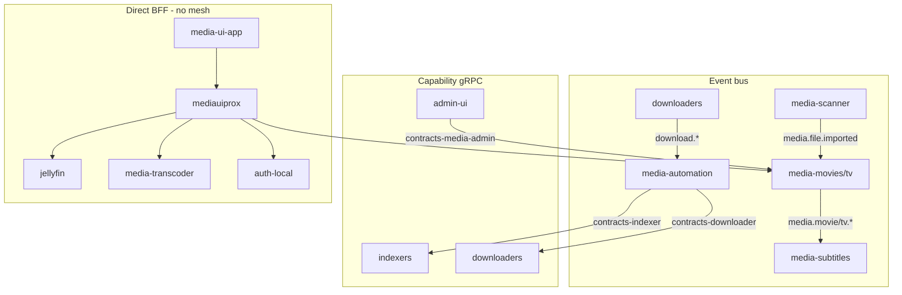
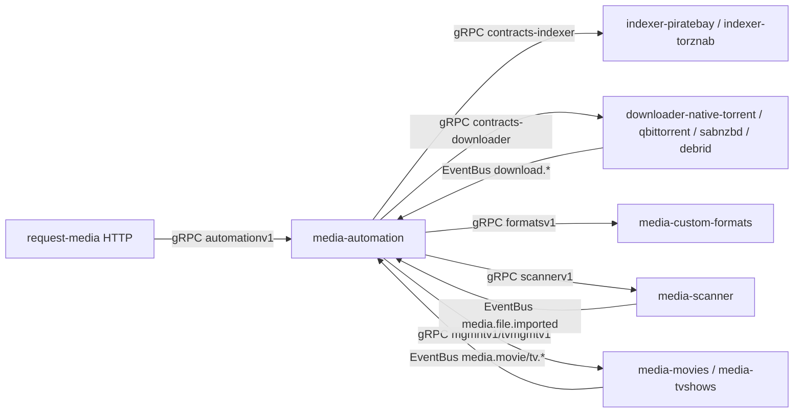
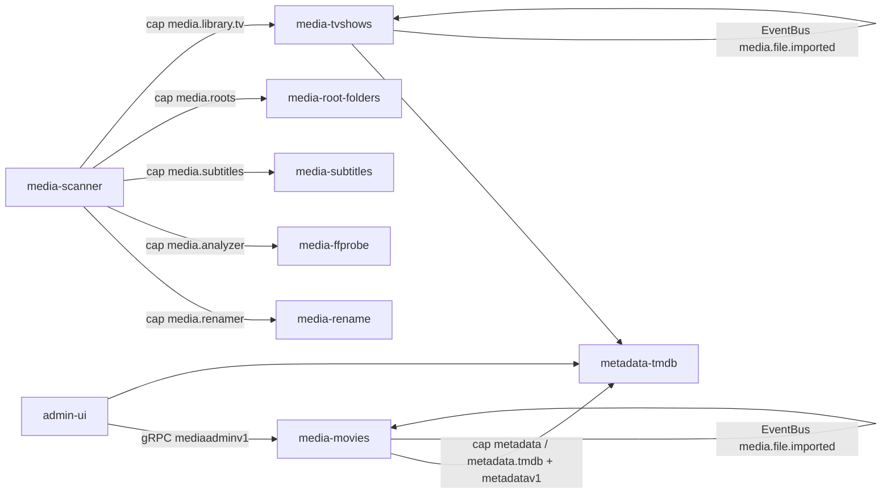
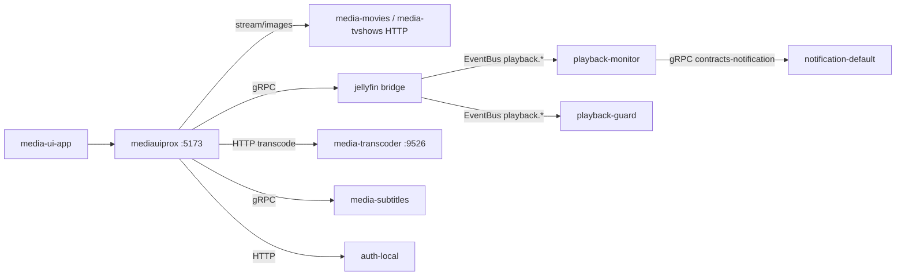
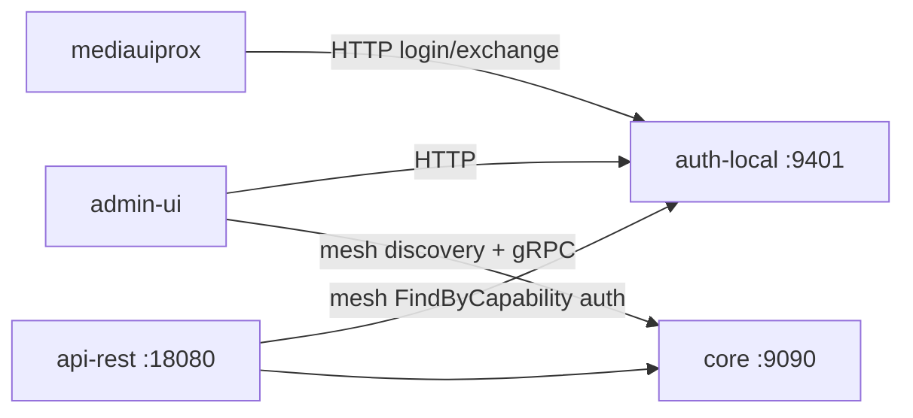
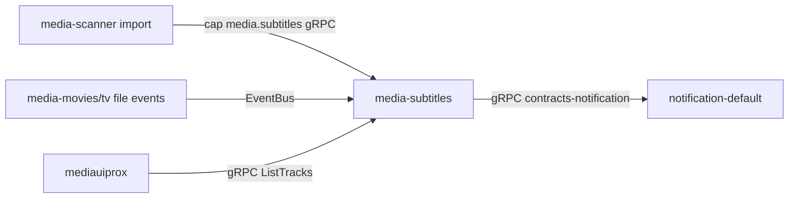

# MuxCore Agent & Cross-Module Communication Audit

**Generated:** 2026-08-21  
**Scope:** 84 git repos under `/home/ender/Projects/MuxCore`  
**Goal:** Audit per-repo agent guidance and cross-repo module interactions; catalog discrepancies to fix, unify, separate, deduplicate, and correct.

---

## Executive Summary

| Layer | Health | Main Issue |
|-------|--------|------------|
| **Agent docs** | Poor | 6/84 repos have guidance; 5 dumps duplicate the same 229-line `AGENTS.md` |
| **Canonical surfaces** | OK | Root `AGENTS.md` (infra), `media-ui-app/AGENTS.md` (consumer UI) |
| **Polluted dumps** | Quarantined but noisy | Still ship broken muxidx, stale paths, nested module copies |
| **Module mesh** | Works on MVP stack | `_mvp/run-host.sh` remaps ports; bare defaults collide widely |
| **Contracts** | Drifting | Phantom `MediaScanner`, missing `contracts-metadata`, events split across repos |

---

## Part 1 — Per-Repo Agent / Subagent Landscape

### What Exists Today

| Repo | Agent Files | Role |
|------|-------------|------|
| **MuxCore root** | `AGENTS.md` | Homelab deploy (vault/dawn/dusk, SSH, Forgejo) — **correct, active** |
| **media-ui-app** | `AGENTS.md` | Frontend design system — **unique, active** |
| **5 dump repos** | `AGENTS.md` + `CLAUDE.md` + muxidx + githooks + `.claude/` | **Byte-identical legacy stack** |
| **78 other repos** | Nothing | Including `core`, `_mvp`, `muxcorectl-cli`, `admin-ui`, all media modules |

**Repos with any agent guidance:** 6 of 84  
**Repos with zero guidance:** 78

### Duplication Clusters (Deduplicate These)

#### Cluster A — Legacy Workspace `AGENTS.md` (5 copies)

| MD5 cluster | Repos |
|-------------|-------|
| Byte-identical | `muxcorectl`, `custom-scripts`, `media-jellyfin`, `media-ui` |
| Same content, 3 path substitutions | `cache-memory` (`/home/enderk/claude` → `/home/ender/Projects/Muxcore/cache-memory` — wrong casing) |

Content: Go agent conduct, Definition of Done, muxidx protocol, directory layout, git hooks. **Not repo-specific.**

#### Cluster B — `CLAUDE.md` Stub (5 copies)

All identical: `See [AGENTS.md](AGENTS.md) for project instructions and conventions.`

Repos: all 5 dump repos above.

#### Cluster C — `scripts/muxidx/` (5 full copies)

All Python files (`main.py`, `mcp_server.py`, `store.py`, etc.) are **byte-identical** across the 5 repos.

- `muxidx.sh` and `.githooks/*/post-commit` all hardcode `/home/enderk/claude/…`
- Broken symlink in each dump: `scripts/muxidx/muxidx → /home/enderk/claude/scripts/muxidx/muxidx.sh` (target does not exist)

#### Cluster D — `.githooks/` (5 copies)

Identical tree: `core/`, `wiki/`, `modules/` with `post-commit` + `post-merge`.

Only `core/` has a different hook (`pre-commit` for Go lint/secrets) — separate from dump hooks.

#### Cluster E — Agent IDE Config (5 copies)

Identical across dumps:

- `opencode.json` — MCP muxidx → `/home/enderk/claude/.venv/bin/python3`
- `.claude/settings.local.json` — same stale venv + muxidx paths

#### Cluster F — Unique Docs (Not Duplicated)

| File | Purpose |
|------|---------|
| `/home/ender/Projects/MuxCore/AGENTS.md` | **Homelab infra** (vault/dawn/dusk, SSH, deploy) — active, correct paths |
| `media-ui-app/AGENTS.md` | **Frontend design system** (Netflix-style SPA) — active, repo-specific |

### Stale / Incorrect References

| Path Pattern | Occurrences | Status |
|--------------|-------------|--------|
| `/home/enderk/claude/` | AGENTS.md (4 dumps), muxidx.sh, muxidx symlink, githooks, opencode.json, `.claude/settings` | **Stale** — old workspace root |
| `/home/ender/Projects/Muxcore/cache-memory/` | cache-memory AGENTS.md only | **Partial fix, wrong casing** (`Muxcore` vs `MuxCore`) |
| `/home/ender/Projects/MuxCore` | Root AGENTS.md | **Correct** |
| `/home/enderk/claude/core` | `_mvp/REPO-STATUS.md`, `_wave1/REPO-STATUS.md`, dump `notes/*.md` | **Stale** |

No `.cursor/rules/` files exist anywhere (root `.cursor/` is empty). No `.cursorrules` files found.

### Repos Missing Agent Guidance (78)

All module repos lack guidance, including high-traffic ones:

- **Platform:** `core`, `_mvp`, `muxcorectl-cli`, `muxcore-docs`, `muxcore-module-starter`, `muxcore-operator`
- **UIs:** `admin-ui`
- **Media stack:** `media-scanner`, `media-automation`, `media-movies`, `jellyfin`, etc.
- **Infra modules:** `auth-local`, `cache-local`, `cache-redis`, `database-postgres`, etc.

`_mvp` (local MVP stack) has no `AGENTS.md` despite being the primary dev entry point referenced in root AGENTS.md.

### Polluted Dumps (Separate / Archive)

Confirmed per `MASTER-ROADMAP.md` Appendix H and quarantine READMEs. **All five are workspace dumps, not real modules.**

| Dump | Polluted? | What's Nested Inside | Canonical Replacement |
|------|-----------|----------------------|----------------------|
| **media-ui** | Yes | ~13 top-level dirs; **`ui/`** = old React/Vite SPA snapshot; shared module copies; docker-compose; notes | `media-ui-app` |
| **media-jellyfin** | Yes | ~35 dirs; 22 gitlinks (160000, no `.gitmodules`); full module tree copy | `jellyfin` |
| **cache-memory** | Yes | ~35 dirs; 22 gitlinks; misnamed — not the cache module, entire workspace snapshot | `cache-local` / `cache-redis` |
| **custom-scripts** | Yes | ~35 dirs; 22 gitlinks; no unique scripts repo content | None (ignore) |
| **muxcorectl** | Yes* | ~36 dirs; 22 gitlinks; stub `go.mod` + partial `internal/cli/`; **`cmd/muxcorectl`** imports missing packages | `muxcorectl-cli` |

\*`muxcorectl` is quarantined per its README but **not listed in Appendix H** — inconsistency in roadmap docs.

**Common dump contents (all 5):**

- Duplicated agent stack: AGENTS.md, CLAUDE.md, `.githooks/`, `scripts/muxidx/`, `.claude/`, `opencode.json`
- `docker-compose.yml`, `flags.yaml`, `core-settings.json`
- Git submodule links to ~22 modules without `.gitmodules`
- `notes/` with SAST/concurrency audits referencing `/home/enderk/claude/core`

**Real implementations live elsewhere:**

- CLI → `muxcorectl-cli/` (full `internal/cli/` tree)
- Consumer SPA → `media-ui-app/` (has its own AGENTS.md)
- Cache → `cache-local/`, `cache-redis/` (no agent docs)

### Agent Doc Actions

| Action | Target |
|--------|--------|
| **Unify** | Single muxidx + `.githooks/` at workspace root; one MCP config |
| **Strip** | Remove agent pollution from all 5 dumps (keep quarantine README only) |
| **Add** | Targeted docs for `core`, `_mvp`, `muxcorectl-cli`, `admin-ui`, `muxcore-module-starter` |
| **Keep separate** | Root infra `AGENTS.md` + `media-ui-app/AGENTS.md` (different audiences) |
| **Do not** | Copy 229-line dump AGENTS.md into each of 78 bare repos |
| **Fix stale paths** | `/home/enderk/claude` → `/home/ender/Projects/MuxCore` everywhere |

---

## Part 2 — Cross-Repo Module Communication

MuxCore uses three communication layers:

1. **Event bus** (async domain signals) — centered on `download.*` and `media.*` events; playback events ad hoc
2. **Capability discovery + gRPC** — infrastructure via `core/pkg/contracts` caps; domain via `contracts-*` repos
3. **Direct HTTP/gRPC BFF** — `mediauiprox` bypasses the mesh for consumer UI latency

### Architecture Overview



### `core/pkg/contracts/` — What Exists

**Role:** Stable Go interfaces for core↔module lifecycle and infrastructure. Event *envelope* types live here; most domain event constants still live in `media_events.go` (historical drift vs. stated policy in `events.go`).

| Category | Files / Interfaces |
|----------|-------------------|
| **Module lifecycle** | `module.go` (`Module`, `Registry`), `events.go` (`EventBus`, `PublishPolicyProvider`), `eventschema.go`, `cluster.go` |
| **Infrastructure capabilities** | `capabilities.go` — `secrets`, `database`, `cache`, `metrics`, `tracing`, `auth`, `authorizer`, `identity`, `storage`, `workflow.engine`, `executor.*`, etc. |
| **Domain events (still in core)** | `media_events.go` — `media.movie.*`, `media.tv.*`, `media.file.imported`, `download.*`, payloads |
| **Auth / security** | `auth.go`, `identity.go`, `audit.go`, `callpolicy.go` |
| **Data / infra** | `database.go`, `cache.go`, `storage.go`, `secrets.go`, `encryption.go`, `backup.go`, `eventstore.go`, … |
| **Observability / resilience** | `metrics.go`, `tracing.go`, `circuitbreaker.go`, `retry.go`, `ratelimit.go`, `health.go` |
| **Other** | `workflow.go`, `worker.go`, `mesh.go`, `spool.go`, `settings.go`, `scheduler.go`, … |

**Notable gap:** `media-scanner/muxcore.json` declares a `MediaScanner` contract on `core/pkg/contracts`, but **no `MediaScanner` interface exists** in that package, and `media-scanner/internal/module.go` `Info()` doesn't declare any contracts at runtime.

### `contracts-*` Repos

| Repo | Service / Interface | Canonical Consumers |
|------|---------------------|---------------------|
| **contracts-downloader** | `DownloaderService` (`muxcore.downloader.v1`) | `media-automation`, `downloader-native-torrent` (adapter), `downloader-qbittorrent` |
| **contracts-indexer** | `IndexerService` (`muxcore.indexer.v1`) | `media-automation` (fan-out to all `indexer` modules), `indexer-piratebay`, `indexer-torznab` |
| **contracts-media-admin** | `MediaAdminService` | `media-movies`, `media-tvshows`, `media-music`, `admin-ui`, `muxcorectl-cli` |
| **contracts-notification** | `NotificationService` / `NotificationProvider` | `notification-default`, `media-subtitles`, `playback-monitor`, `playback-guard`, `media-library-maintainer` |
| **contracts-reconciler** | Library only — compares third-party contract repos to canonical paths and emits `go mod replace` | Used by `core/internal/module/mgr/manager.go` for marketplace/spool normalization |

**Missing repo referenced in manifests:** `metadata-tmdb/muxcore.json` declares `github.com/Muxcore-Media/contracts-metadata` / `MetadataProvider`, but **no `contracts-metadata` repo exists in the workspace**; the module uses local `metadata-tmdb/proto/metadatav1` instead.

### Phantom Contracts (Fix or Remove from `muxcore.json`)

**media-scanner** — declares interface that does not exist:

```json
"contracts": [
  {
    "repo": "github.com/Muxcore-Media/core/pkg/contracts",
    "interface": "MediaScanner",
```

**metadata-tmdb** — declares repo that does not exist:

```json
"repo": "github.com/Muxcore-Media/contracts-metadata",
"interface": "MetadataProvider"
```

### Proto Architecture: Centralized vs Duplicated

#### Centralized (Correct Pattern)

- **Core infra:** `core/proto/muxcore/{auth,events,policy,discovery,...}/v1`
- **Domain contracts:** `contracts-{downloader,indexer,media-admin,notification}/proto/...`

#### Dual-Proto Modules (Intentional Adapter)

- **`downloader-native-torrent`:** Native `proto/downloaderv1` (`TorrentService`, VPN/NAT-PMP) **plus** `contracts-downloader` adapter in `internal/contracts_server.go`. Callers using the shared contract see `DownloaderService`; native clients see extended API.

#### Module-Local Protos (No Contract Repo Yet)

| Proto | Used By |
|-------|---------|
| `media-scanner/proto/scannerv1` | `media-automation`, `admin-ui`, `muxcorectl-cli` |
| `media-movies/proto/mgmntv1`, `media-tvshows/proto/tvmgmtv1` | `mediauiprox`, consumer streaming/images |
| `media-automation/proto/automationv1` | `request-media`, admin paths |
| `metadata-tmdb/proto/metadatav1` | `media-movies`, `media-tvshows`, `request-media` |
| `media-transcoder/proto/transcodev1` | admin-ui, internal |
| `jellyfin/proto/jellyfinv1` | `mediauiprox`, jellyfin bridge |
| `media-subtitles/proto/subtv1` | `mediauiprox`, scanner sidecar calls |

#### Stale Duplicated Vendor Trees (Problem)

Embedded copies under `muxcorectl/`, `media-ui/`, `media-jellyfin/`, `custom-scripts/`, `cache-memory/` carry **old protos and wrong defaults**:

- `notification-default/proto/notifyv1/` — superseded by `contracts-notification`
- `metadata-tmdb/proto/`, `media-movies/proto/`, `downloader-native-torrent/proto/` — full duplicates with **different default ports** (e.g. downloader `:9460` vs canonical `:9461`, metadata `:9410` vs `:9411`, notification `:9440` vs `:9441`)

### Event Bus — Publishers / Subscribers

Canonical event strings for media/download live in `core/pkg/contracts/media_events.go`. Several modules use **undocumented string literals** instead.

#### Download / Acquisition Events

| Event | Publishers | Subscribers |
|-------|------------|-------------|
| `download.started` | `downloader-native-torrent`, `downloader-qbittorrent`, `downloader-debrid`, `downloader-sabnzbd` | `media-automation`, `notification-default` |
| `download.completed` | Same downloaders | `media-automation`, `notification-default`, `jellyfin` (library refresh) |
| `download.failed` | Same downloaders | `media-automation`, `notification-default` |
| `download.dispatched` | `media-automation` | `notification-default` |
| `media.import.failed` | `media-automation` | `notification-default` |

#### Library Events

| Event | Publishers | Subscribers |
|-------|------------|-------------|
| `media.file.imported` | `media-scanner` | `media-automation`, `media-movies`, `media-tvshows`, `media-subtitles`, `media-transcoder`, `notification-default`, `jellyfin` |
| `media.movie.added/removed/updated`, `media.movie.file.added/removed` | `media-movies` | `media-automation`, `media-subtitles`, `notification-default` |
| `media.tv.added/removed/updated`, `media.tv.episode.file.added/removed` | `media-tvshows` | Same |
| `media.movie.requested`, `media.tv.requested` | `request-media` (**not in contracts**) | *(no known subscribers)* |

#### Playback Events (Defined Ad Hoc, Not in `media_events.go`)

| Event | Publishers | Subscribers |
|-------|------------|-------------|
| `playback.started` / `playback.stopped` | `jellyfin`, `emby`, `plex`, `playback-monitor` | `playback-monitor`, `playback-guard`, admin notification rules |
| `playback.guard.violation` | `playback-guard` | `playback-monitor` |
| `playback.library.item` | `jellyfin` | `playback-monitor` |

#### Known Event-Name Bug (P0)

`jellyfin/internal/module.go` subscribes to **`media.imported`**, which is never published. The canonical event is `media.file.imported`. Jellyfin still gets refreshes via `download.completed` and `media.file.imported`, but the dead subscription is misleading.

Also referenced in `jellyfin/README.md` and `jellyfin/CHANGELOG.md`.

### `mediauiprox` BFF (`_mvp/cmd/mediauiprox`)

**Does not use the mesh/event bus.** Direct gRPC + HTTP to backends.

| Backend | Mechanism | Default Target |
|---------|-----------|----------------|
| **media-movies** | gRPC `MovieManagementService` + HTTP proxy (`/stream/movies`, `/images/movies`) | `:9420` / `:9430` |
| **media-tvshows** | gRPC `TvManagementService` + HTTP proxy | `:9440` / `:9450` |
| **jellyfin** | gRPC `JellyfinBridge` (`ListItemLinks`, `PlayURL`, `Status`) | `:9475` |
| **media-subtitles** | gRPC `SubtitleService` + HTTP subtitle files | `:9520` / `:9521` |
| **request-media** | HTTP reverse proxy (`/api/search`, `/api/request`, `/api/requests`) | `:9380` |
| **media-music/books/comics/audiobooks** | HTTP health + library list proxy (optional) | `:9641`–`:9671` |
| **media-transcoder** | HTTP playback (`/stream/transcode`, `/healthz`) | `:9526` (gRPC `:9525`) |
| **auth-local** | HTTP redirect + `/login/exchange` (browser vs internal URL) | `:9401` |
| **Local state** | JSON files (userdata, livetv, library-paths, password-reset) | filesystem |

**Not called by mediauiprox:** `media-automation`, `metadata-tmdb`, `media-scanner`, `contracts-*`, core mesh, `api-rest`.

Dual library API is intentional: consumer uses `mgmntv1`/`tvmgmtv1`; admin uses `contracts-media-admin`.

### Interaction Graphs by Cluster

#### Acquisition



#### Library



#### Playback



#### Auth



#### Subtitles Sidecar



### Capability String Drift

| Issue | Where | Severity |
|-------|-------|----------|
| **`media-transcoder` code advertises `"transcoder"`; `muxcore.json` omits it** | `media-transcoder/internal/module.go` vs `muxcore.json` | P1 |
| **`media.scoring` vs `media.formats`** — automation discovers `media.scoring`; muxcore.json lists both | automation ↔ custom-formats | P2 |
| **Generic `media.library` in embedded vendor `muxcore.json`** — missing `media.library.movies/tv` | `muxcorectl/`, `media-ui/`, etc. | P1 if those copies are run |
| **`contracts-indexer` version `v1` vs `v0.1.0` elsewhere** | indexer muxcore.json | P2 |
| **Phantom `MediaScanner` contract** in muxcore.json, absent from core | `media-scanner/muxcore.json` | P1 |
| **Phantom `contracts-metadata`** in muxcore.json | `metadata-tmdb/muxcore.json` | P1 |
| **`media.request` vs CLI `capMediaRequest`** | aligned | OK |

### Port Collisions — `_mvp/PORTS.md` vs Module Defaults

`_mvp/run-host.sh` sets explicit env overrides for the MVP stack (safe). **Bare `go run` without env has many collisions** not reflected in `PORTS.md`.

#### P0 — Same Default Port, Different Modules

| Port | Colliding Modules |
|------|-------------------|
| **9550** | `secrets-file` ↔ `playback-monitor` |
| **9551** | `secrets-vault` ↔ `playback-guard` |
| **9540** | `media-library-maintainer` ↔ `media-root-folders` |
| **9640** | `media-music` ↔ `circuitbreaker-simple` |
| **9670** | `spool-resolver-http` ↔ `media-audiobooks` |
| **9660** | `media-comics` ↔ `input-validate-jsonschema` |
| **9650** | `media-books` ↔ `data-redaction-pattern` |
| **9630** | `serialization-safe` ↔ `downloader-debrid` |
| **9620** | `downloader-sabnzbd` ↔ `logging-file` |
| **9610** | `cache-local` ↔ `storage-s3` ↔ `distributed-lock-sqlite` |

#### P0 — PORTS.md Swapped vs Code Defaults

| Module | PORTS.md | Code Default |
|--------|----------|--------------|
| **metadata-tmdb** | `:9410` | `:9411` |
| **auth-oidc gRPC** | `:9411` | `:9410` |

#### P1 — Missing from PORTS.md (Code Uses Them)

| Port | Module / Use |
|------|--------------|
| `:9526` | `media-transcoder` playback HTTP (mediauiprox default) |
| `:9521` | `media-subtitles` HTTP |
| `:9485` / `:9486` | `indexer-piratebay` / `indexer-torznab` |
| `:9476` / `:8476` | `plex` |
| `:9477` / `:8477` | `emby` |
| `:9550` / `:8550` | `playback-monitor` |
| `:9551` | `playback-guard` (also secrets-vault — collision) |
| `:9720` | `media-transcoder-pool` |
| `:9710` | `media-intro-outro` |

### `go.mod` `replace ../core` Directives

- **74 modules** still contain sibling-path replaces
- **56 of 74** are inside polluted dump trees

Example:

```go
replace github.com/Muxcore-Media/core => ../core
replace github.com/Muxcore-Media/core/pkg/contracts => ../core/pkg/contracts
```

Fine for monorepo dev layout but **breaks standalone module CI/publish** unless replaced with tagged module versions.

---

## Part 3 — Prioritized Action Backlog

### P0 — Runtime / Silent Failure

1. **Resolve port collisions** — reassign defaults for playback-monitor/guard, library-maintainer/roots, music/circuitbreaker, etc.; update `_mvp/PORTS.md` and module defaults together
2. **Fix PORTS.md auth-oidc ↔ metadata-tmdb swap** (`9410`/`9411`)
3. **Remove jellyfin subscription to `media.imported`** — use `contracts.EventFileImported` only; update README/CHANGELOG
4. **Document/add `:9526` and `:9521`** to PORTS.md (mediauiprox depends on them)

### P1 — Unify Contracts & Deduplicate Trees

5. **Move domain events out of `core/pkg/contracts/media_events.go`** into a `contracts-media` (or per-domain) repo; add `media.movie.requested` / `media.tv.requested` or wire subscribers
6. **Create `contracts-metadata`** or drop the phantom declaration from `metadata-tmdb/muxcore.json`
7. **Fix `media-scanner` contract declaration** — either add `MediaScanner` to contracts or remove from muxcore.json
8. **Align `media-transcoder` muxcore.json** with runtime caps (`transcoder` alias)
9. **Delete or quarantine embedded vendor module copies** (`muxcorectl/media-ui/...`) — they duplicate protos, ports, and capabilities
10. **Consolidate agent infra to workspace root**; strip from dumps
11. **Add `muxcorectl` to MASTER-ROADMAP Appendix H**
12. **Org-wide core pin batch** (~20 non-MVP modules still using `replace => ../core`)

### P2 — Hygiene & Agent Guidance

13. **Publish playback event constants** (`playback.started`, etc.) in a contract package
14. **Unify indexer contract version tags** (`v1` → `v0.1.0`)
15. **Replace monorepo `../core` with published semver** in module go.mod files for Forgejo/spool consumers
16. **Consider `contracts-scanner` + `contracts-automation`** for `scannerv1` / `automationv1` currently module-local
17. **Document dual library API** (`mgmntv1` consumer vs `mediaadminv1` admin) — optionally converge behind contracts-media-admin for read paths in mediauiprox long-term
18. **Add targeted `AGENTS.md`** for `core`, `_mvp`, `muxcorectl-cli`, `admin-ui`, `muxcore-module-starter`
19. **Populate `.cursor/rules/`** with pointer to root + domain docs
20. **Fix all `/home/enderk/claude` stale references** in REPO-STATUS, notes, muxidx

---

## Recommended Sequencing

| Phase | Focus | Rationale |
|-------|-------|-----------|
| **Phase 1** | Port table + jellyfin event fix | Small PRs, high impact, stops silent failures |
| **Phase 2** | Dedup pollution | Archive/strip 5 dumps; consolidate muxidx/githooks to root; update Appendix H |
| **Phase 3** | Contract truth | Phantom contracts, metadata contract repo, event constants |
| **Phase 4** | Agent guidance | Thin per-domain docs (not 229-line clones); module-starter template |
| **Phase 5** | Publish hygiene | Drop `replace => ../core` on remaining modules; GHCR/Actions billing per REPO-STATUS |

---

## Quick Stats

| Metric | Count |
|--------|------:|
| Git repos (depth 1) | 84 |
| Repos with any agent guidance | 6 |
| Repos with zero guidance | 78 |
| Duplicated AGENTS.md clusters | 2 (+ 2 unique) |
| Polluted dump repos carrying full agent stack | 5 |
| Broken muxidx symlinks | 5 |
| Modules with `replace => ../core` | 74 |
| Replace directives inside dumps | 56 |

---

## Related Docs

- [`AGENTS.md`](AGENTS.md) — Homelab infra agent reference (active)
- [`MASTER-ROADMAP.md`](MASTER-ROADMAP.md) — Appendix H polluted dumps
- [`_mvp/REPO-STATUS.md`](_mvp/REPO-STATUS.md) — Module packaging status
- [`_mvp/PORTS.md`](_mvp/PORTS.md) — Default module ports
- [`media-ui-app/AGENTS.md`](media-ui-app/AGENTS.md) — Consumer UI design system

---

## Resolution Log (2026-08-21)

Items resolved in this pass — no executive decision required (doc fixes, remove phantom declarations, align manifest with code).

| # | Item | Resolution |
|---|------|------------|
| 2 | PORTS.md metadata-tmdb ↔ auth-oidc swap | Fixed: TMDB `:9411`, auth-oidc gRPC `:9410` / HTTP `:9412` |
| 3 | Jellyfin `media.imported` dead subscription | Removed from `jellyfin/internal/module.go`; README + CHANGELOG updated |
| 4 | Missing ports in PORTS.md | Added `:9526`, `:9521`, indexers, plex/emby, playback-monitor/guard, transcoder-pool, intro-outro |
| 6 | Phantom `contracts-metadata` | Removed from `metadata-tmdb/muxcore.json` (no repo exists yet) |
| 7 | Phantom `MediaScanner` contract | Removed from `media-scanner/muxcore.json` |
| 8 | `media-transcoder` cap drift | Added `"transcoder"` to `media-transcoder/muxcore.json` |
| 11 | `muxcorectl` missing from Appendix H | Added to `MASTER-ROADMAP.md` Appendix H → `muxcorectl-cli` |
| 20 | Stale `/home/enderk/claude` in REPO-STATUS | Clarified as historical path in `_mvp/REPO-STATUS.md` and `_wave1/REPO-STATUS.md` |

Also added **Known default-port collisions** section to `_mvp/PORTS.md` documenting unresolved collisions without reassigning ports.

### Deferred — requires executive / architectural decision

| # | Item | Why deferred |
|---|------|--------------|
| — | **Sibling `replace => ../module` in admin-ui etc.** | Intentional monorepo dev overrides; only `core` replaces were removed org-wide (except `_mvp`) |
| — | **Publish new contract repos to Forgejo** | `contracts-media`, `contracts-playback`, `contracts-metadata`, `contracts-scanner`, `contracts-automation` exist locally; need tags + CI |
| — | **Delete nested vendor trees inside dumps** | Agent pollution stripped; full gitlink trees remain until GitHub archive |
| — | **Full playback literal → contracts-playback migration** | Started in `playback-monitor`; jellyfin/emby/plex/admin-ui still use string literals in many files |
| — | **Proto codegen for new contract repos** | `.proto` files copied; run `make proto` when protoc available |
| — | **Restore workspace muxidx at root** | Dump copies removed; indexer tooling not recreated yet |

---

## Resolution Log — Wave 2 (2026-08-21)

| Area | Done |
|------|------|
| **Port collisions** | Reassigned 11 modules to unique defaults; `_mvp/PORTS.md` updated (no collision section) |
| **Contract repos created** | `contracts-media`, `contracts-playback`, `contracts-metadata`, `contracts-scanner`, `contracts-automation` |
| **Domain events moved** | Canonical source `contracts-media/events`; `core/pkg/contracts/media_events.go` re-exports; request-media uses constants |
| **Polluted dumps stripped** | Removed AGENTS.md, CLAUDE.md, muxidx, githooks, opencode, .claude from 5 dumps |
| **Org-wide core pin** | Removed `replace => ../core*` from 17 module go.mod files; `_mvp` keeps local replace |
| **AGENTS.md** | 88 repos now have AGENTS.md (generator + bespoke core/_mvp/admin-ui/cli/starter); `.cursor/rules/muxcore-workspace.mdc` |
| **Contract splits** | muxcore.json updated for scanner/automation/metadata; reconciler canonical registry extended |
| **Playback events** | `contracts-playback` created; `playback-monitor` subscribes via constants |
