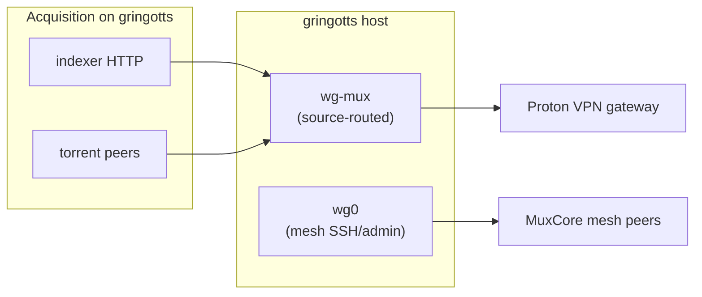

# MuxCore mesh TLS (Caddy edge)

Private **MuxCore Mesh CA** + HTTPS reverse proxy on gringotts (`:80` / `:443`).
MVP modules stay on localhost; browsers use `https://*.gringotts`.

## Generate CA and host cert (on gringotts)

```bash
cd mvp/tls
./gen-mesh-ca.sh
./gen-host-cert.sh gringotts
```

## Start Caddy

```bash
cd mvp
./caddy/run-caddy.sh
# or: systemctl --user enable --now muxcore-caddy.service
# (install unit: cp caddy/muxcore-caddy.service ~/.config/systemd/user/)
```

Requires `CAP_NET_BIND_SERVICE` or root to bind 80/443.

## Trust CA on every mesh machine

Copy `tls/ca/ca.crt` (or run from a checkout that has it):

```bash
./tls/install-mesh-trust.sh ./tls/ca/ca.crt
```

NixOS: after install, `imports = [ ./muxcore-mesh-trust.nix ];` and `nixos-rebuild switch`.

## Public URLs

| Host | Service |
|------|---------|
| https://admin.gringotts | admin-ui |
| https://media.gringotts | media-ui |
| https://api.gringotts | api-rest |
| https://auth.gringotts | auth-local |
| https://core.gringotts | core HTTP |
| https://health.gringotts | health-monitor |

Dev login: `admin` / `admin-dev-only` (see `mvp/.env`).

## WireGuard VPN (gringotts)

Downloader uses **source-routed** WireGuard (`WG_CONF`, interface from conf basename, e.g. `wg-mux`).
Only traffic from the tunnel address (e.g. `10.2.0.2`) exits via Proton; mesh `wg0` stays intact.

- Do **not** set `WG_USE_WG_QUICK=1` or kill-switch on gringotts (mesh hub) — full-tunnel `wg-quick` installs an OUTPUT kill-switch that breaks mesh SSH.
- NAT-PMP auto-starts when the conf comments include `NAT-PMP ... = on` (or `NAT_PMP_PORT` is set); gateway is Interface `DNS` (Proton: `10.2.0.1`). Map only through the VPN gateway — never open that port on mesh `wg0` / LAN.
- Isolated download-only hosts may use `WG_USE_WG_QUICK=1` / `WG_KILL_SWITCH=true` if they are not mesh hubs.

### Prove VPN before live grabs

```bash
# On gringotts, from mvp/:
./scripts/check-vpn-up.sh
# Fails if WG_CONF missing/unreadable, iface down, or curl --interface <wg-mux> cannot fetch an egress IP.
```

Live `downloader-native-torrent` refuses Init when `DOWNLOADER_ENGINE` is not `fixture`/`fake` (or `DOWNLOADER_REQUIRE_VPN=1`) unless `WG_CONF` is readable. On `MUXCORE_HOST_ROLE=gringotts` (or hostname containing `gringotts`) it also refuses `WG_USE_WG_QUICK=1` and `WG_KILL_SWITCH=true`.

Live `indexer-piratebay` / remote `indexer-torznab` HTTP uses the **same source-bind policy**: dial via the WG iface from `WG_CONF` (`SO_BINDTODEVICE` + tunnel address). Fixture / loopback paths skip the bind. There is no clearnet fallback when a live base URL is set.

Downloader live engine defaults **DHT/PEX off** when `WG_CONF` is set, blocks RFC1918/loopback peers via IP blocklist, and rebinds listen host to the WireGuard IP after VPN up.

### Packet path



ASCII:

```
indexer HTTP + torrent peer traffic ──► wg-mux ──► Proton (10.2.0.1)
SSH / admin / mesh gRPC             ──► wg0    ──► MuxCore mesh only
```

See also: [SECRET-ROTATION.md](SECRET-ROTATION.md) (rotation drill), [MTLS-STAGING.md](MTLS-STAGING.md), [../docs/ACQUISITION.md](../docs/ACQUISITION.md) (library roots, enable/disable live acquisition).
